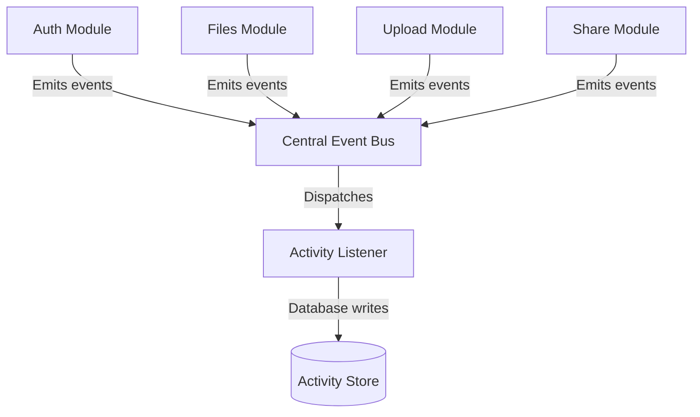

# FileFlow Activity Module Architecture

The **Activity Module** is the central event-tracking engine for FileFlow. It captures system logs, security updates, file operations, and public ingestion transfers to power analytics dashboards, security audits, and future notifications.

---

## 1. Central Event Bus Architecture

To maintain loose coupling between core modules (auth, files, uploads, shares) and the tracking database logs, FileFlow implements the **Publisher-Subscriber (Event Bus) Pattern**:

### Event Flow
1. A service performs a state modification (e.g. `createFile`).
2. The service publishes a standard domain event to the shared singleton `eventBus` (e.g. `'file.created'`).
3. An initialized asynchronous listener (`ActivityListener`) intercepts the event, extracts payloads, formats a description, and persists it into the Activity database.

---

## 2. Severity Classification Matrix

Every logged activity is graded on a three-tier severity scale:

| Severity | Description | Log Type Mappings |
|---|---|---|
| **INFO** | Normal operations containing standard trace info. | `REGISTER`, `LOGIN`, `FILE_UPLOADED`, `SHARE_CREATED`, `UPLOAD_STARTED`, `UPLOAD_COMPLETED` |
| **WARNING** | Administrative status revisions or non-critical failures. | `LOGOUT`, `FILE_DELETED`, `FILE_ARCHIVED`, `SHARE_REVOKED`, `UPLOAD_FAILED` |
| **CRITICAL** | Security-sensitive actions. | `PASSWORD_CHANGED` |

---

## 3. Analytics Aggregations

The `/api/v1/activity/summary` endpoint computes summary counts:
- `totalActivities`: rolling count of all user logs.
- `uploads`: count of `FILE_UPLOADED` records.
- `shares`: count of `SHARE_CREATED` records.
- `downloads`: count of `SHARE_DOWNLOADED` records.
- `profileChanges`: count of `PROFILE_UPDATED` or `PASSWORD_CHANGED` records.
- `recentActivityCount`: count of events occurring in the last 7 days.
