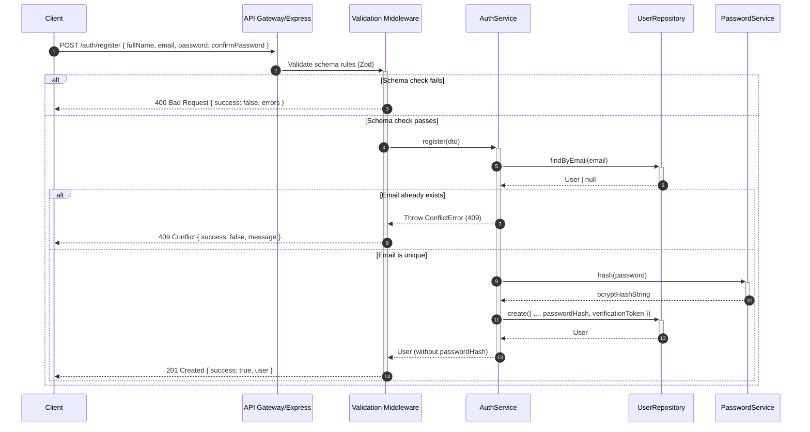
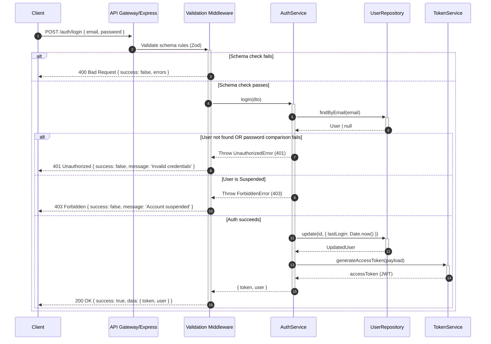

# FileFlow Authentication Flow

This document details the step-by-step logic, validation loops, and sequence of actions for FileFlow's authentication operations.

---

## 1. Registration Flow (`POST /api/v1/auth/register`)

### Key Rules
- **Strong Passwords**: Must contain at least 8 characters, 1 uppercase, 1 lowercase, 1 digit, and 1 special symbol.
- **Verification Token**: A secure random hex string is generated (`crypto.randomBytes(32)`).
- **Initial Account Status**: Created with `PENDING_VERIFICATION` status and `emailVerified: false`.

---

## 2. Login Flow (`POST /api/v1/auth/login`)

---

## 3. Email Verification Flow (`GET /api/v1/auth/verify-email?token=...`)

1. User clicks the link containing the `token` parameter.
2. Client queries `GET /api/v1/auth/verify-email?token=...`.
3. Validation middleware verifies the presence of the query parameter.
4. **AuthService** finds the user matching `verificationToken`:
   - Checks if the token has expired (expires 24 hours after creation).
   - If valid, updates user's attributes: `emailVerified: true`, `accountStatus: ACTIVE`, and clears out the temporary token and expiration dates.
5. Returns the updated User profile payload with code `200 OK`.

---

## 4. Password Recovery Flows

### A. Forgot Password (`POST /api/v1/auth/forgot-password`)
- Request requires `{ email }`.
- Generates a secure token (`crypto.randomBytes(32)`), setting expiration to 1 hour.
- Stores token hashes on the target user record.
- **Security Check**: Returns `200 OK` indicating a reset link will be sent if an account matches the email, preventing user scanning attacks.

### B. Reset Password (`POST /api/v1/auth/reset-password`)
- Requires `{ token, password, confirmPassword }`.
- Verifies token validity and expiration.
- Hashes the new password using `PasswordService` and updates database credentials, clearing reset fields.

---

## 5. Cognito AWS Integration Readiness

When migrating authentication to AWS Cognito:
- **Registration**: Express delegates user registration to Cognito `signUp` API, which natively handles hashing and confirmation delivery.
- **Login**: Auth requests are sent to Cognito `initiateAuth`. Cognito returns JWT ID, access, and refresh tokens.
- **Route Guard**: The `protect` middleware is updated to fetch Cognito's JWKS public keys and decode ID tokens instead of checking our local database.
