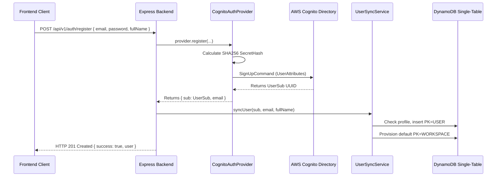
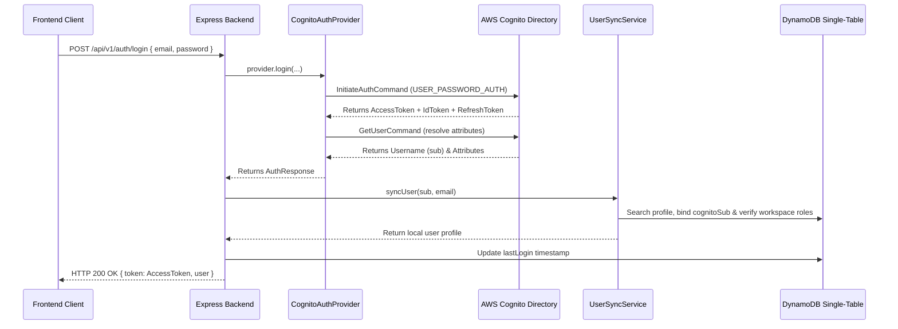
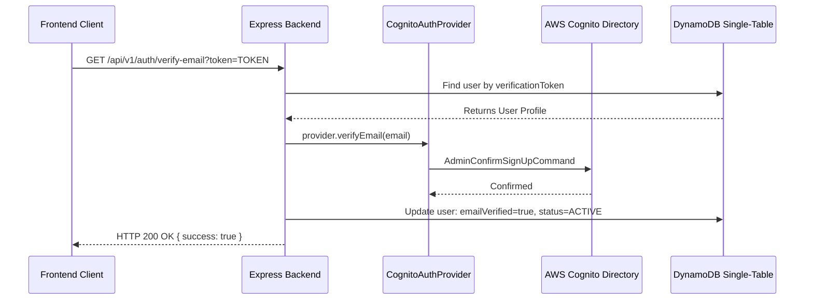
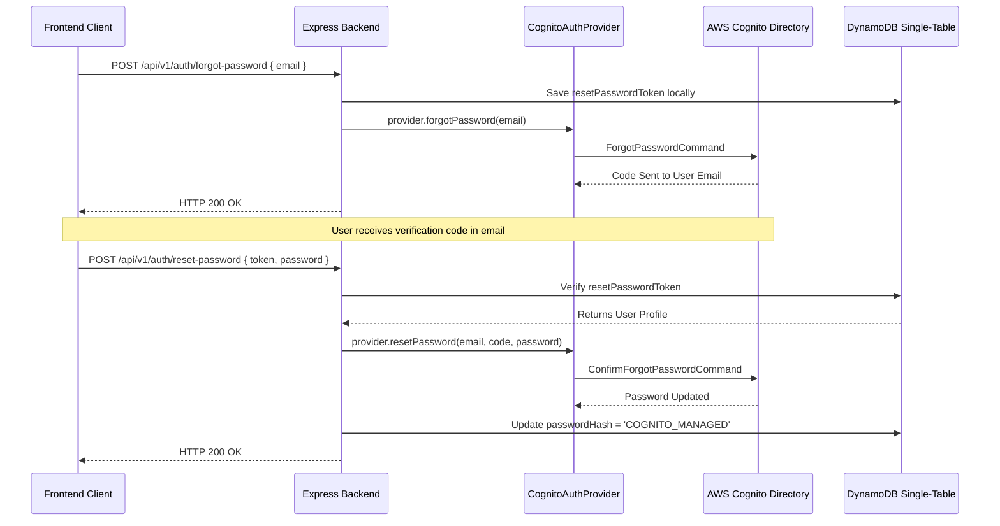

# AWS Cognito Integration User Flows

This document details the step-by-step sequences and data mapping rules for all identity lifecycles integrated with AWS Cognito.

---

## 1. User Registration Flow

### Steps:
1.  The client sends a registration request containing the user's name, email, and password.
2.  The backend calls `provider.register()`.
3.  `CognitoAuthProvider` calculates the HMAC-SHA256 Client Secret Hash if a client secret is configured, and sends a `SignUpCommand` to Cognito.
4.  Cognito creates the user account in a `UNCONFIRMED` state and returns the unique `UserSub`.
5.  `UserSyncService` writes the local user profile and binds the `cognitoSub`.
6.  A default workspace is automatically provisioned for the new user profile.

---

## 2. User Authentication (Login) Flow

### Steps:
1.  The client submits email and password.
2.  `CognitoAuthProvider` sends an `InitiateAuthCommand` using flow type `USER_PASSWORD_AUTH`.
3.  Cognito validates credentials and returns session tokens.
4.  The provider retrieves user attributes using `GetUserCommand` to verify attributes like `custom:role` and `custom:planType`.
5.  The backend calls `UserSyncService.syncUser()` which looks up the user locally by `cognitoSub` (or email if linking a legacy user) and updates user claims.
6.  The backend updates the user's `lastLogin` timestamp and returns the token and profile.

---

## 3. Email Verification Flow

### Steps:
1.  The user clicks the verification link, forwarding the unique token query parameter to the backend.
2.  The backend looks up the profile matching the verification token and ensures it hasn't expired.
3.  The backend calls `provider.verifyEmail(email)`.
4.  `CognitoAuthProvider` uses `AdminConfirmSignUpCommand` to confirm the user within the user pool directory.
5.  The backend marks `emailVerified: true` and `accountStatus: 'ACTIVE'` locally.

---

## 4. Password Recovery / Reset Flow

### Steps:
1.  The user requests a password reset by providing their email.
2.  The backend saves a reset token locally and calls `provider.forgotPassword()`.
3.  Cognito triggers a ForgotPassword code email directly to the user.
4.  The user enters the code and their new password on the frontend page.
5.  The backend verifies the local reset token and calls `provider.resetPassword()`.
6.  `CognitoAuthProvider` confirms the password reset in Cognito, and the backend updates the local password hash to `COGNITO_MANAGED`.
