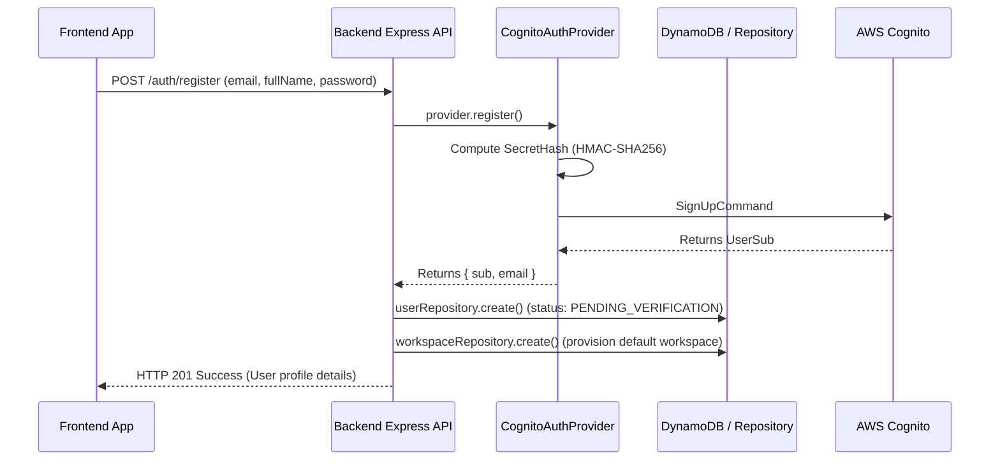
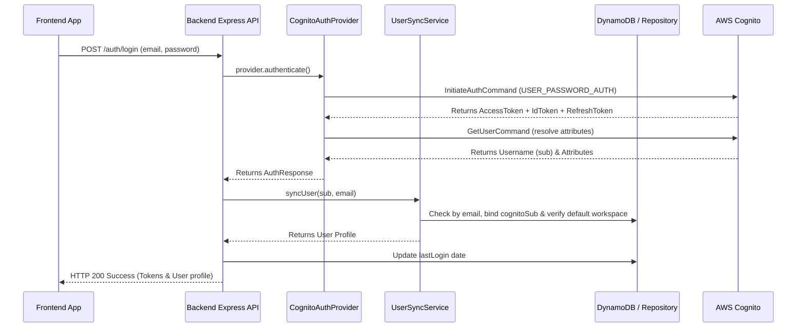
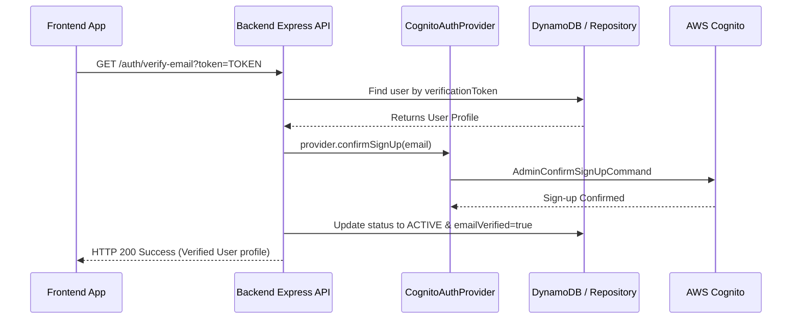
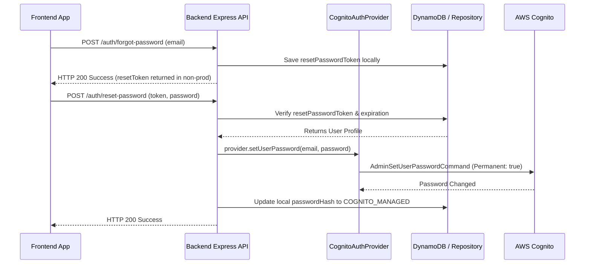

# AWS Cognito Integration User Flows

This document details the step-by-step sequences for all user flows managed by the AWS Cognito Integration Layer.

---

## 1. User Registration Flow

---

## 2. User Authentication (Login) Flow

---

## 3. Email Verification Flow

---

## 4. Password Recovery Flow

