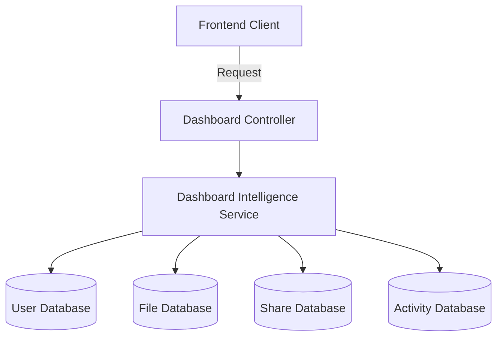

# FileFlow Dashboard Module Specification

The **Dashboard Intelligence Module** functions as the central command center of FileFlow, dynamically generating workspace analytics, storage trends, security metrics, and health statuses.

---

## 1. Architectural Design

Unlike other modules, the Dashboard Module is **stateless**:
- It does not contain any database tables or collections.
- It aggregates data dynamically on-the-fly by querying core domain repositories:
  - `UserRepository` (storage limits, plans)
  - `FileRepository` (file counts, file sizes, security ratings, favorite counts)
  - `ShareRepository` (active links, access rules, download volumes)
  - `ActivityRepository` (recent events timelines, audit traces)

---

## 2. Future Performance Tuning (Caching Architecture)

Since dashboard aggregations involve scanning multiple domain datasets, caching is critical for scaling to thousands of concurrent workspaces:
1. **Redis Caching Wrapper**:
   - Introduce a `getCachedOrCompute` utility inside `DashboardService`.
   - Store calculated dashboards as JSON in Redis, keyed by `userId:dashboard:overview` with a short TTL (e.g. 5 minutes).
2. **Cache Invalidation Triggers**:
   - Subscribe to the central `eventBus` to invalidate caches immediately on changes (e.g. invalidate overview cache on `file.created`, `file.deleted`, or `share.created` events).
