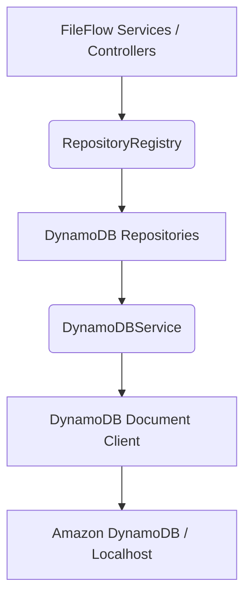

# DynamoDB Design & Client Configuration

This document describes the design, configuration, and architecture of the DynamoDB connection layer for the FileFlow backend.

---

## 1. Architectural Architecture & Connection Layer

FileFlow relies on the AWS SDK v3 `@aws-sdk/client-dynamodb` and `@aws-sdk/lib-dynamodb` packages. Database interactions are abstracted using the singleton `DynamoDBService` wrapper to ensure that connection pools, marshalling options, and credential fallbacks are handled centrally.



## 2. Table Specifications

We utilize a Single Table Design strategy with an **On-Demand (PAY_PER_REQUEST)** billing mode. This is optimal for modern SaaS applications as it scales dynamically from zero to millions of read/write requests without pre-provisioning limits, optimizing cost efficiency.

- **Primary Table Name**: `FileFlow` (configurable via `process.env.DYNAMODB_TABLE_NAME`)
- **Partition Key (`PK`)**: String
- **Sort Key (`SK`)**: String

### Global Secondary Indexes (GSIs)

To support flexible queries, the table is configured with 5 Global Secondary Indexes:

1. **GSI1 (User & Share Lookup)**: PK=`GSI1PK` (String), SK=`GSI1SK` (String)
2. **GSI2 (Workspace & Owner Queries)**: PK=`GSI2PK` (String), SK=`GSI2SK` (String)
3. **GSI3 (Generic ID Lookup)**: PK=`GSI3PK` (String), SK=`GSI3SK` (String)
4. **GSI4 (Platform Activity Logs)**: PK=`GSI4PK` (String), SK=`GSI4SK` (String)
5. **GSI5 (Notification Status Feeds)**: PK=`GSI5PK` (String), SK=`GSI5SK` (String)

---

## 3. Configuration & Marshalling Settings

To simplify code and enforce strict TypeScript typing, the `DynamoDBService` uses the **DynamoDB Document Client**, which automatically marshals JavaScript objects into DynamoDB attribute values and unmarshals them back into JSON.

### Doc Client Configurations
- **convertEmptyValues**: `true` (converts empty strings or lists into null/empty representations).
- **removeUndefinedValues**: `true` (automatically strips out undefined object parameters to prevent DynamoDB write command failures).
- **convertClassInstanceToMap**: `true` (enables saving class instances as nested maps).
- **wrapNumbers**: `false` (forces unmarshalled numbers to return as normal JavaScript numbers rather than BigNumbers).

---

## 4. Environment Parameters

Configure the following variables in `.env` for production environments:

```env
# Database Mode Selector
DB_TYPE=dynamodb

# Table Configuration
DYNAMODB_TABLE_NAME=FileFlow
AWS_REGION=us-east-1

# DynamoDB Local Override (for offline developer boxes)
# DYNAMODB_ENDPOINT=http://localhost:8000

# AWS Credentials
AWS_ACCESS_KEY_ID=your_access_key
AWS_SECRET_ACCESS_KEY=your_secret_key
```
