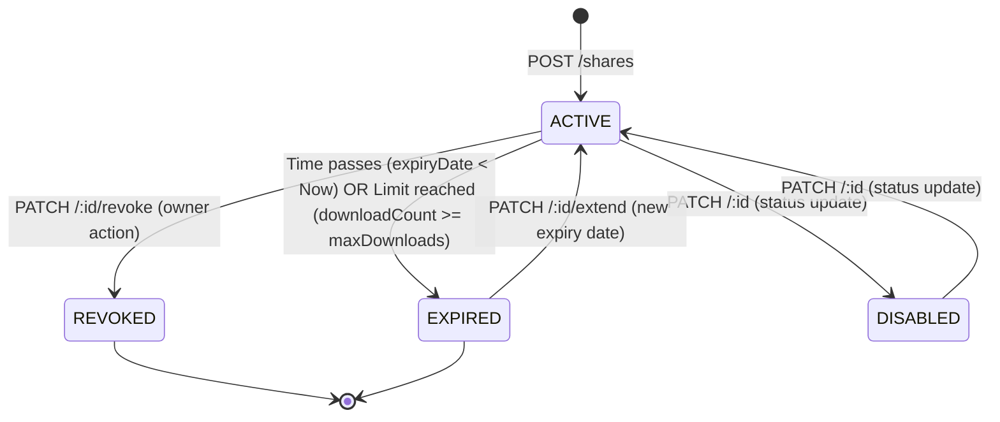

# FileFlow Share Module Architecture Specification

The **Share Module** controls public and workspace access rules for shared assets in FileFlow. It defines how shares are created, validated, extended, and revoked.

---

## 1. Share Lifecycle & States

A share transaction transits through several lifecycle states:

### State Definitions
- **ACTIVE**: The share configuration is valid. Unauthenticated users can view/download/edit (according to `accessLevel`) provided password checks pass.
- **EXPIRED**: The share has surpassed its designated lifespan or maximum downloads count. Access attempts fail automatically.
- **REVOKED**: The owner explicitly revoked the share, terminating access immediately.
- **DISABLED**: The share is temporarily deactivated by the owner but can be re-enabled.

---

## 2. Shared Collaboration Events

The Share Module broadcasts the following core events through `shareEventEmitter` to decouple notification, socket broadcasting, and audit logging services:

| Event Name | Trigger | Payload |
|---|---|---|
| `shareCreated` | Share initialization | `{ ownerId, shareId, fileId }` |
| `shareUpdated` | Changing access levels, passwords, or limits | `{ ownerId, shareId, fileId }` |
| `shareRevoked` | Immediate access revocation | `{ ownerId, shareId, fileId }` |
| `shareDownloaded` | A client completes downloading the file | `{ shareId, fileId, downloadedAt, clientIp, userAgent }` |
| `expiryExtended` | Owner extends access duration | `{ ownerId, shareId, fileId }` |

---

## 3. Dynamic File Security Score Recalibration

Sharing actions directly impact the **Security Score** of the parent File record.
Whenever a share is created, updated, or revoked, the system evaluates all active sharing configurations for the file and applies security deductions:

- **Base Sharing Penalty**: `-15` points (shareStatus transitions to `SHARED`).
- **No Password Protection**: `-10` points (unrestricted public link).
- **No Expiration Date**: `-10` points (link lives indefinitely).
- **No Download Limit**: `-5` points (link can be scraped / bulk downloaded).

*Note: The total penalty is capped at 40 points, meaning a file with no protections will see its score drop by 40, while a fully-secured share (password + expiry + limit) only incurs the baseline penalty (-15 points).*
