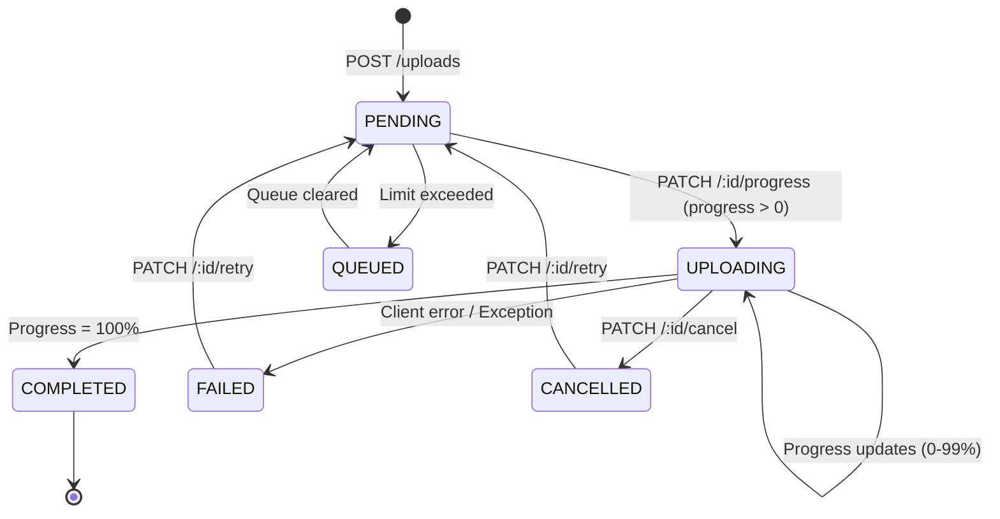

# FileFlow Upload Module Specification

The **Upload Module** manages file ingestion lifecycles in FileFlow, ensuring that files are properly validated, tracked, and registered.

---

## 1. Upload State Machine

An upload transaction transitions through the following lifecycle states:

### State Definitions
- **PENDING**: The upload transaction has been initialized and is ready for data transfer.
- **QUEUED**: The upload is in queue waiting for active slots to clear.
- **UPLOADING**: Data segments are currently being transferred. Progress ranges between `1%` and `99%`.
- **COMPLETED**: Progress has successfully reached `100%`, triggering the automatic creation of a `File` entity inside the File Module.
- **FAILED**: Data transfer failed due to socket termination, timeout, storage quota limits, or server errors.
- **CANCELLED**: The user explicitly cancelled the upload transaction.

---

## 2. Lifecycle Triggers & System Events

To support real-time WebSocket progress updates and decoupled system notifications, the Upload Module broadcasts internal events using the `uploadEventEmitter`:

| Event Name | Trigger | Payload Details |
|---|---|---|
| `uploadStarted` | Fired when `POST /uploads` initializes a new transaction | `{ userId, uploadId }` |
| `uploadCompleted` | Fired when progress reaches 100% and File registration succeeds | `{ userId, uploadId, fileId }` |
| `uploadFailed` | Fired when progress fails or database registration throws an error | `{ userId, uploadId, error }` |
| `uploadCancelled` | Fired when `PATCH /uploads/:id/cancel` is invoked | `{ userId, uploadId }` |

---

## 3. Automatic File Registration

When progress reaches `100%` via `PATCH /uploads/:id/progress`, the service initiates the following atomicity chain:
1. Transitions upload status to `COMPLETED` and sets `completedAt = new Date()`.
2. Invokes `FileService.createFile` with the file metadata (`fileName`, `fileSize`, `mimeType`).
3. If successful, stores the generated `fileId` in the Upload transaction.
4. If `FileService.createFile` fails (e.g. storage limit hit, db exception), catches the error, transitions upload state to `FAILED`, sets the `errorMessage`, and updates `failedAt = new Date()`.
